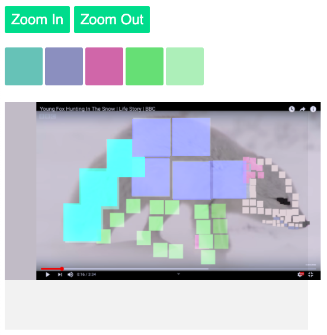
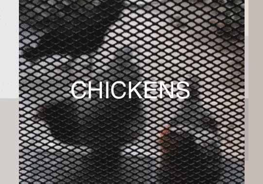
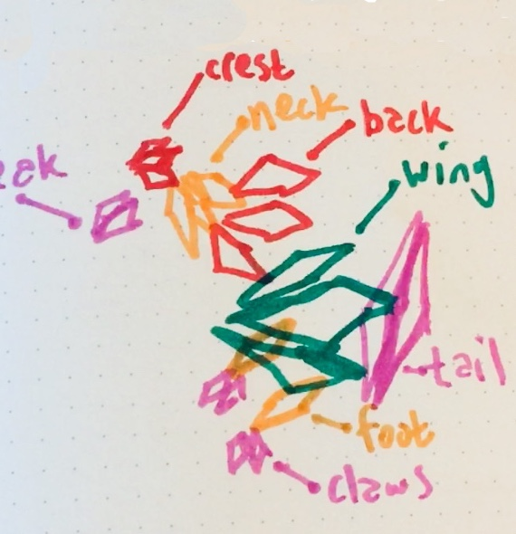

### A pixel painter

A web application for painting pixels at many scales on top of video frames. Written in [onnemi-4211](https://github.com/erikpukinskis/onnemi-4211) JavaScript.

### Run

```
npm install
node .
open http://localhost:8221/flurble?zoom=-2&color=0.2265625**0.296875**0.5703125**0.4000000059604645
```

### Screenshot



### Graphical target



### Design document


